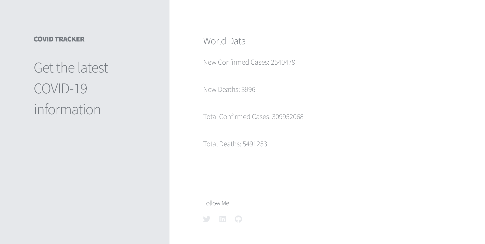

# COVID-19 API
See the current world 

**Link to project:** https://coronavirusworlddata.netlify.app/

## How It's Made:

**Tech used:** HTML, CSS, and JavaScript

I used a COVID API to get the total COVID deaths and cases along with the new COVID deaths and cases for the day

<!-- ## Optimizations
*(optional)*

You don't have to include this section but interviewers *love* that you can not only deliver a final product that looks great but also functions efficiently. Did you write something then refactor it later and the result was 5x faster than the original implementation? Did you cache your assets? Things that you write in this section are **GREAT** to bring up in interviews and you can use this section as reference when studying for technical interviews!

## Lessons Learned:

No matter what your experience level, being an engineer means continuously learning. Every time you build something you always have those *whoa this is awesome* or *fuck yeah I did it!* moments. This is where you should share those moments! Recruiters and interviewers love to see that you're self-aware and passionate about growing. -->

